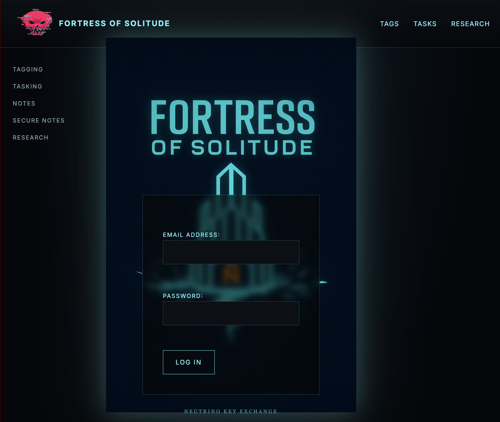

# FortressOfSolitude
A Website that self encrypts data at rest and includes a basic key manager.

# Revision Two of the Fortress of Solitude:
I'm trying to figure out what will be a good road map to support the overall arch of a secure upload-download application where only the user who is logged in could possible know or see their own data. This would minimize privilege escalation attacks as even if you got the database then it would be significantly difficult for modern supercomputers to crack. That's the goal at least, The implementation of the keymanager is attempting to abide by NIST Key Manager Practices for Organizations. 

# Note this is not NIST approved just motivated by an Article published by NIST
Key Manager Practices for Organizations (https://www.nist.gov/publications/recommendation-key-management-part-2-150-best-practices-key-management-organizations)
and does not meet all the requirments due to the implementation is currently creating a new KEK->DEK->256BitKey for every file and Secure Note that is marked for encryption.

    +-+-+-+-+-+-+-+-
    | DEK            |------------------------Generated_KEY (256 bits)
    +-+-+-+-+-+-+-+- |
    |
    +-+-+-+-+-+-+-+- |
    | KEK            |------------|
    +-+-+-+-+-+-+-+- |
    |
    +-+-+-+-+-+-+-+- |
    | SALT           |-----|
    +-+-+-+-+-+-+-+-

Where the SALT is a random number that will be preprended to the KEK (Key Encryption Key) which is the derived DEK (Data Encryption Key)

Therefore Generated_Key = SHA256(SALT + KEK)

However the only thing that is known to the Attacker would be the SALT. The rest would be AES_EAX Encrypted meaning it is Wrapped. The Wrapped KEK, and Wrapped DEK can only be unwrapped by a forumala that is to be determined.

# How to Setup and Initialize
This is a work in progress but here are the steps so far:

` cd FortressOfSolitude `

Before Moving forward be sure to look over the settings.py file
to ensure it is up to par with your needs (default passwords have been changed, etc.).

` python3 manage.py makemigrations `

The above step creates a db.sqlite3 please 
for the love of all that is Holy make sure to 
update your Password for the Database in the settings.

` python3 manage.py migrate `
    

` python3 manage.py createsuperuser `

You will fill out an email and password for your account, 
remember the password is what wraps your keys so make sure 
its secure (long enough) for your needs.
    
` python3 manage.py runserver `

This will open a default server at http://127.0.0.1:8000
    
    To get to most of the features such as the encrypted Notes (Secure Notes) you will need to manually traverse to http://127.0.0.1:8000/blog
    

    

